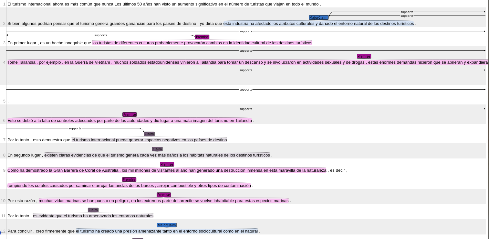

# Argument Mining

**Argument Mining** is a set of python tools with the purpose of:

- Project corpus between langauges.
  - Projecting a corpus is a technique that creates corpus from a source language (mostly english) to a target language.
- Extract and classify arguments and relations from unnanotated text.
  - Using tensorflow models to perform the tasks
- Scrap the web.
  - Contains spiders to scrap Granma newspaper, the sections of `Printed Press` and `Letters to Management`
- Visualize and modify the classified arguments and relations
  - Streamlit app to easly manage the tasks of training, projecting and infering.
  - Brat annotation tool is used to view and correct annotations

Go [here](https://github.com/luisoibarra/thesis) for more information about the models.

## Setup

Some tools are missing from the release and need to be installed. Go to `scripts/` and run `./install_tools.sh`. This will download and install the tools and embeddings. This step is required for both setup preocesses. After the script has finished follow the steps in the selected setup process below.

### Colab

A working example in [Colab](https://colab.research.google.com/drive/1iCVAoVXXtsgnHddjoVyXUPrLcNgYok1Z?usp=sharing) or open the `ArgumentMiningColab.ipynb` in Colab.

### Local

Run the script `./install.sh`

### Docker (Recommended)

The repository supports the Development Container feature for Visual Studio Code, also the code can be executed on a container running a Jupyter Notebook server. This allows a fast setup with minimal installation.

**Requirements:**

- docker
- Visual Studio Code with `ms-vscode-remote.vscode-remote-extensionpack` extension _(Optional)_

**Build docker image:**

- Go to `scripts/`
- Run `./build_docker_image.sh`

**Run Development Container:**

1. Open Visual Studio Code in the repository folder.
2. Open the command pallette and select `Remote-Containers: Open Folder in Container`
3. Work as usual in Visual Studio Code

**Run Jupyter Notebook:**

1. Go to `/scripts` folder and run `./run_docker_container.sh`
2. Click on the link prompted
3. Open the desired notebook

**Run Streamlit app:**

1. Go to `/scripts` folder and run `./run_docker_streamlit.sh`
2. Click on the link prompted

## Basic Usage

Some python modules are generated from jupyter notebooks. **Never** touch this modules, instead modify the notebook according your needs. For example, `link_prediction/models/link_prediction.ipynb` generates `link_prediction/models/link_prediction.py`, the modules are generated to avoid boilerplate code and be able to import the functions in the notebooks.

### Training

This package doesn't come with trained models. To train the models the repository comes with several corpora splitted in train, dev and test, also a much smaller dataset is present just to quickly verify that all is in order. To change dataset in the notebooks change the `INFO_TAG` variable to the corpus name.

1. Go to `scripts/` and run `./process_paragraph_corpus.sh persuasive_essays_paragraph` to create the corpus projection.
2. Train segmenter model:

  - Open `segmenter/models/segmenter.ipynb` and run the cells needed for training and saving the model. (Recomended)
  - Run `./train_segmenter.sh`.

3. Train link predictor model:

  - Open `link_prediction/models/link_prediction.ipynb` and run the cells needed for training and saving the model. (Recomended)
  - Run `./train_link_predictor.sh`

### Classify and extract argument segmentation and link prediction

After the training is completed simply open `main.ipynb` and run the wanted cells.

### Python API and Console

All packages comes with a console interface and an extensible Python API.

## Packages

The tasks are separated into packages. All packages that perform a task has a console interface. All argumnets that are directories will read/write the files in the inmediate path.

### Corpus Parser

This [package](corpus_parser/README.md) is in charge of the parsing of the data. The supported types of data are CoNLL and Brat.

### Sentence Aligner

This [package](sentence_aligner/README.md) is in charge of splitting the text's sentences and align them to its translation on a given language.

### Aligner

This [package](aligner/README.md) is in charge of finding the word alignmets between sentences in a source and a target language.

### Projector

This [package](projector/README.md) is in charge of projecting the labels from the original corpus into the new corpus in the target language.

### Segmenter

This [package](segmenter/README.md) is in charge of performing the argument segmentation on unnanotated text. Also contains the code to train, evaluate and use the model.

### Link Prediction

This [package](link_prediction/README.md) is in charge of predicting the relations between arguments. Also contains the code to train, evaluate and use the model.

### Pipelines

This [package](pipelines/README.md) is to ease the procedures of projection and link prediction by wrapping the processes in a single function call.

### Scrapper

This [package](scrapper/README.md) is in charge of scrap the web and save the information.

### Scripts

This [package](scripts/README.md) is in charge of storing all scripts.

### Utils

This [package](utils/README.md) is in charge of storing utility functions.

### Data

This [directory](data/README.md) contains all the outputs from the differents steps.

### Pos tagger

This [directory](pos_tagger/README.md) contains the algorithms to perform the POS tagging task.

### Streamlit app

This [directory](streamlit_app/README.md) contains the streamlit app implementation.

## Data Visualization

The tool use for visualization and correction is [brat rapid annotation tool (brat)](https://github.com/nlplab/brat). To run the brat server go to `scripts/` and run `./run_brat.sh`, this will show an URL that can be opened by almost any browser.

The data must be in `brat/data/` to the program to see it and in a brat format. It can be export from `main.ipynb`.

